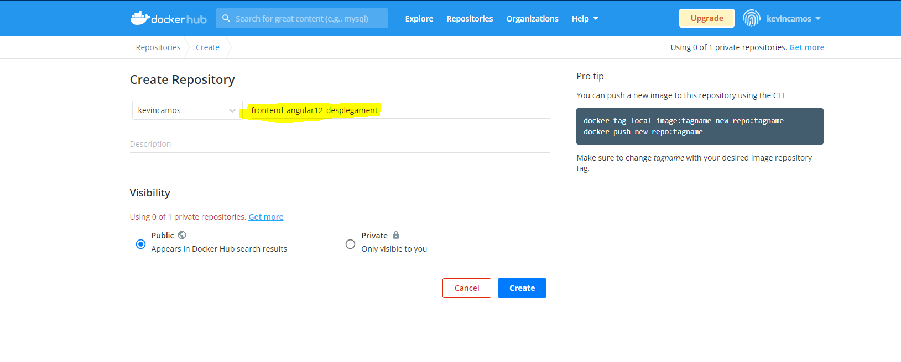
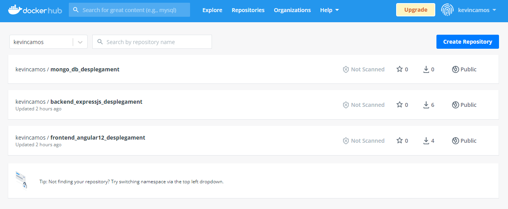

# NodeJS_Express_Mongo_Angular12

## 'Por Juanmi Bellod y Kevin Camós"

`Pasos git`

Creamos la etiqueta v1 - "Versión inicial de la aplicación"

```s
$ git tag -a v1 -m “Versión inicial de la aplicación”
```

Creamos una nueva rama

```s
$ git checkout -b main_branch
```

`Como crear la network`

```sh
$ docker network create --driver bridge bualabob
```

`Como crear la imagen y contenedor del frontend Angular`

Creando el dockerfile

```docker
FROM  node:14-alpine
WORKDIR /usr/src/app/client
COPY package.json package-lock.json ./
RUN npm install
COPY . .
EXPOSE 4200
RUN npm install -y -g @angular/cli
CMD ng serve --host 0.0.0.0
```

Creando el .dockerignore

```docker
node_modules
npm-debug.log
```

Ejecutar el dockerfile

```docker
$ docker build -t frontend ./cliente
```

Creando el contenedor

```docker
$ docker run -p 4200:4200 --name angular_frontend --network bualabob  frontend
```

`Como crear la copia de seguridad de la BBDD, la imagen y el contenedor de Mongo`

Creando la copia de seguridad de la BBDD de Bualabob

```s
$ mongodump --host 127.0.0.1:27017 -db bualabob
```

Creando el dockerfile

```docker
FROM mongo
RUN mkdir dump
COPY /dump /dump
EXPOSE 27017:27017
```

Ejecutar el dockerfile

```docker
$ docker build -t mongo-contain .
```

Creando el contenedor

```docker
$ docker run -p 27017:27017 --name mongo-contain --network bualabob  mongo
```


###### `nota:` Al no haber podido restaurar la BBDD ni en la imágen con "RUN mongorestore /dump" o "CMD mongorestore /dump", ni tampoco desde el "run" del contenedor.  La única solución que hemos conseguido ha sido que... tras la creación del contenedor con el script ejecutame.sh, fuera de éste utilizar. (Dentro del script también da error) 

```
$ docker exec mongo-contain mongorestore /dump
``` 
`Como crear la imagen y contenedor del backend Expressjs`

Creando el dockerfile

```docker
FROM node:17-alpine3.12
WORKDIR /usr/src/app

COPY . .
RUN npm install

EXPOSE 4000

CMD ["npm", "run", "dev"]
```

Creando el .dockerignore
```docker
node_modules
npm-debug.log
```

Ejecutar el dockerfile

```docker
$ docker build -t backend /servidor
```

Creando el contenedor

```docker
$ docker run -p 4000:4000 --name backend_contenedor --network bualabob backend
```

`ShellScript que automatice la instalación`

```sh
#Creamos el network
docker network create --driver bridge bualabob

#FRONTEND
#Creamos la imágen de frontend
docker build -t frontend ./cliente
#Creamos el contenedor de frontend
docker run -d -p 4200:4200 --name angular_frontend --network bualabob  frontend

#MONGO
#Creamos la imágen de mongo
docker build -t mongo-image .
#Creamos el contenedor de frontend
docker run -d  -p 27017:27017 --name mongo-contain --network bualabob  mongo-contain

#BACKEND
#Creamos la imágen de mongo
docker build -t backend ./servidor
#Creamos el contenedor de frontend
docker run -p 4000:4000 --name backend_contenedor --network bualabob backend
```


`Tras la instalación de los contenedores`


`Análisis de los elementos necesarios dentro de cada dockerfile (si habéis necesitado establecer variables de entorno, publicar determinados puertos, ejecutar la instalación de alguna herramienta, el motivo de la elección de la imagen base, etc).`

Hemos utilizado la imagen oficial de Mongo, y las imágenes ligeras de Node, con la etiqueta de versión “alpine” ya que considerábamos que así le quitábamos carga de peso a la imágen


`Posibles cambios realizados en el código para poder adecuar este al proceso de dockerización realizado`

En el servidor, hemos cambiado la variable DB_MONGO sobriescribiendo localhost por el nombre del contenedor de mongo sustituyendo a localhost en la ruta NodeJS_Express_Mongo_Angular12\servidor\variables.env


cambiar nombre del archivo NodeJS_Express_Mongo_Angular12\servidor\models\Product.model.js a
NodeJS_Express_Mongo_Angular12\servidor\models\product.model.js


`Como tarea de investigación, intentad subir vuestras imágenes generadas a docker hub. Documentad dicho proceso en el fichero readme también.`

```
https://hub.docker.com/r/kevincamos/backend/tags 
```
Creamos un repositorio en https://hub.docker.com/ 



Visualizamos las imágenes que tenemos y ejecutamos el siguiente comando para que en al subir el repositorio, docker sepa qué imágen debe de subir a qué repositorio.

```
$ docker tag frontend:latest kevincamos/frontend_angular12_desplegament
```
```
$ docker push kevincamos/frontend_angular12_desplegament
```


Repetimos este paso en las dos imágenes restantes de Expressjs y Mongo 



